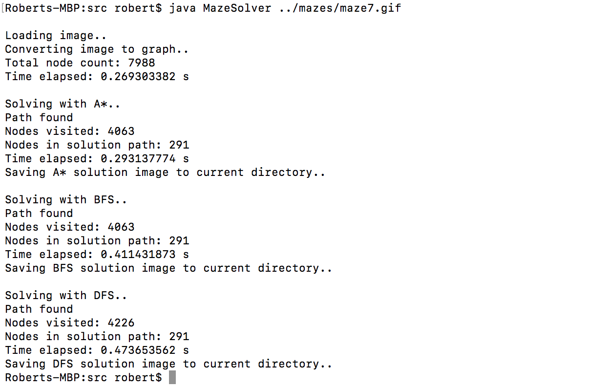

# MazeSolver

## About
A maze solver written in Java. The goal of this project was to implement various search algorithms. For now, this are A*, Breadth First Search and Depth First Search. I will try to implement more algorithms in the future. 

## How to run
### Compile
- download the project
- compile the src folder
### Run
- from the src directory type <b>java MazeSolver ../mazes/<i>"maze-file-name"</i></b>
- if you want to run only individual algorithms, add a second parameter: 
  d - Depth First Search 
  b - Breadth First Search 
  a - A* Search 
  For example: 
  <b>java MazeSolver ../mazes/<i>"maze-file-name"</i> bd</b> - runs only the BFS and DFS search

## What mazes can it solve?
I have included a couple of maze examples in the mazes folder, however, feel free to add your own mazes. 
<b>Use <a href="http://hereandabove.com/maze/mazeorig.form.html">this website</a> to generate your own mazes and use these parameters:</b> 
- path width: 1
- wall width: 1
- wall color: 0 0 0
- path color: 255 255 255
