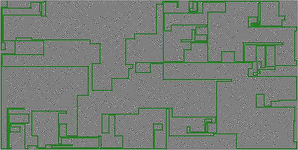

# MazeSolver

## About
A maze solver written in Java.
 
This project is in early stages. I have only implemented the A* algorithm for now. More search algorithms will follow. I will also try to implement some sort of time and space complexity measure and to compare various search algorithms.

## How to run
### Compile
- download the project
- compile the src folder
### Run
- from the src directory type <b>java MazeSolver ../mazes/<i>"maze-file-name"</i></b>

## All about mazes
I have included a couple of maze examples in the mazes folder, however, feel free to add your own mazes. 
<b>Use <a href="http://hereandabove.com/maze/mazeorig.form.html">this website</a> to generate your own mazes and use these parameters:</b> 
- path width: 1
- wall width: 1
- wall color: 0 0 0
- path color: 255 255 255
